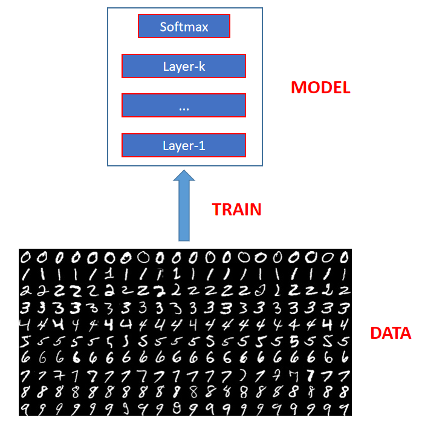
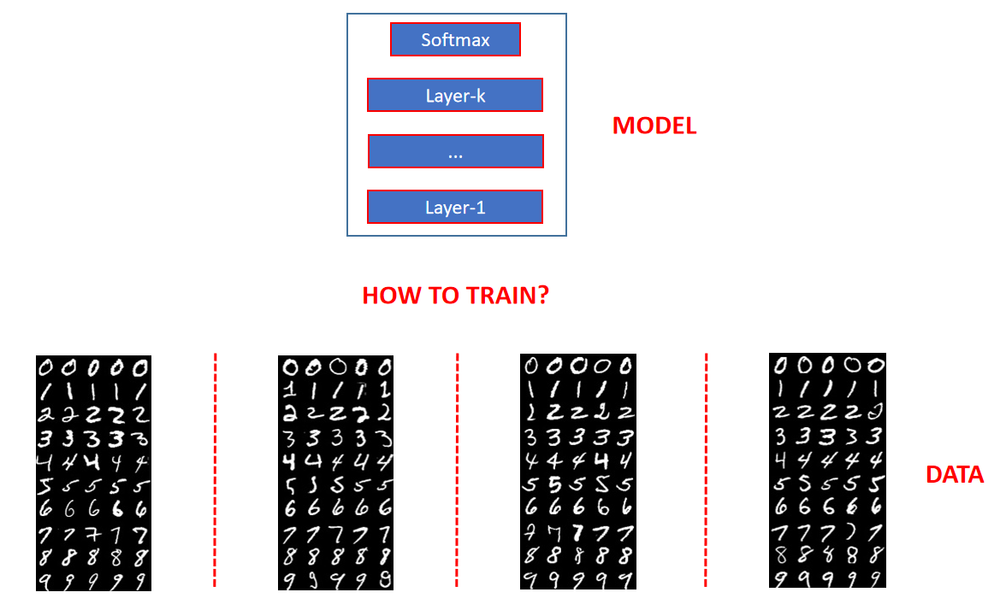
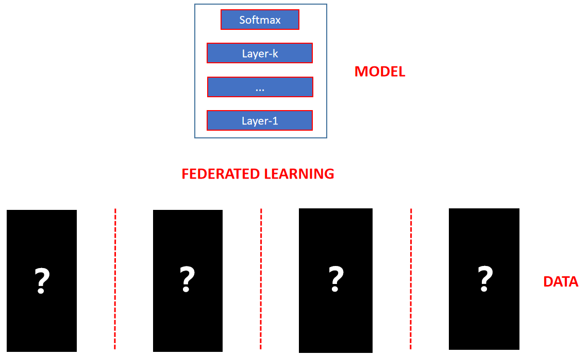
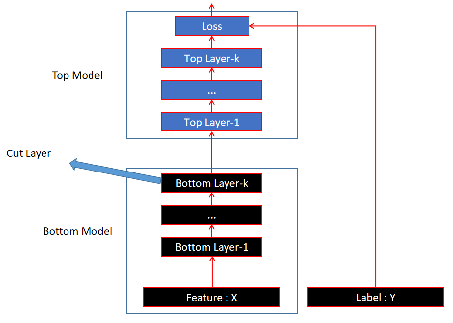
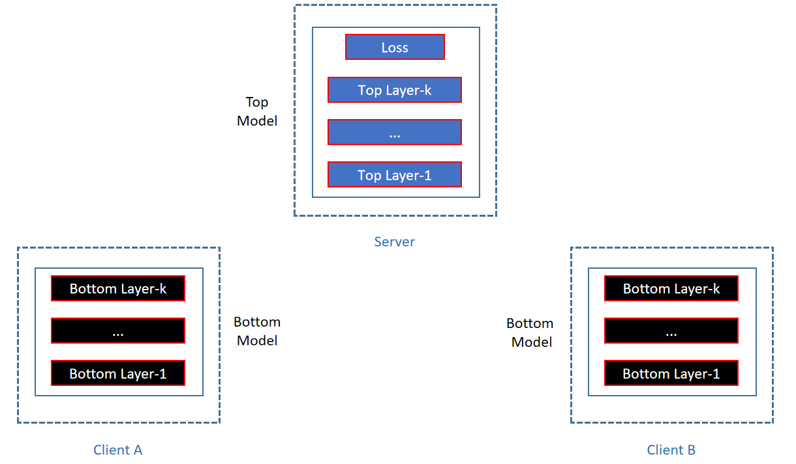
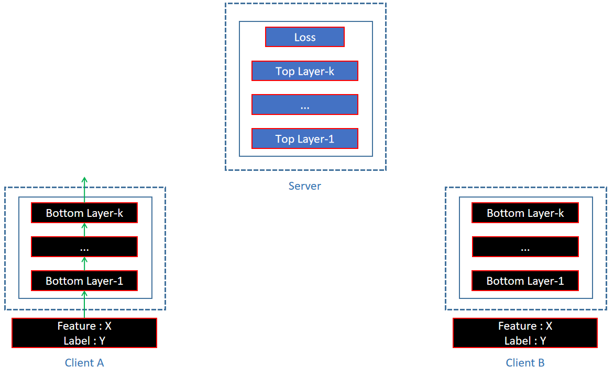
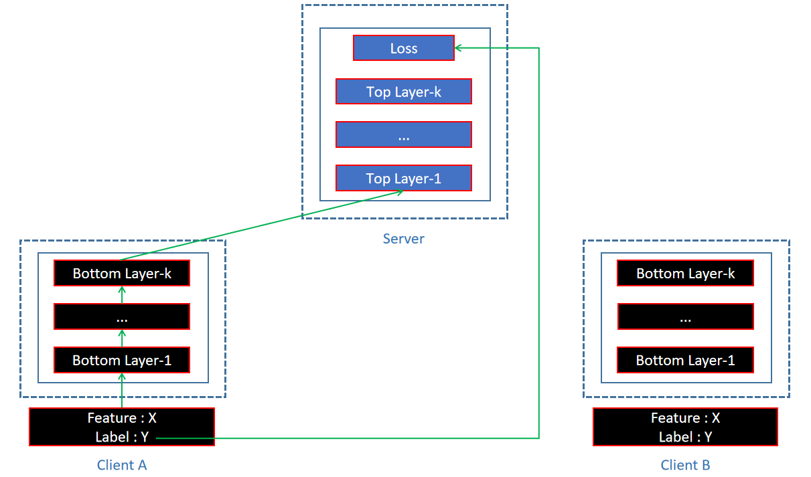
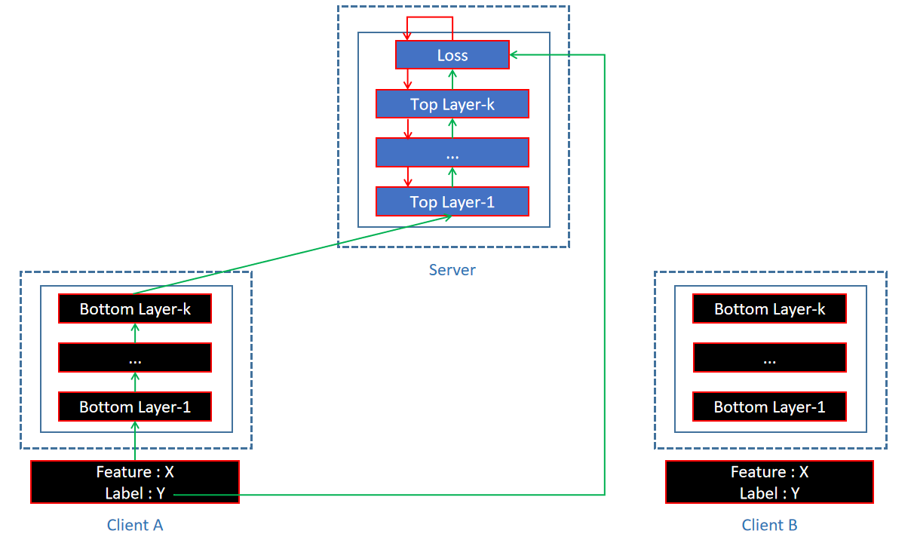
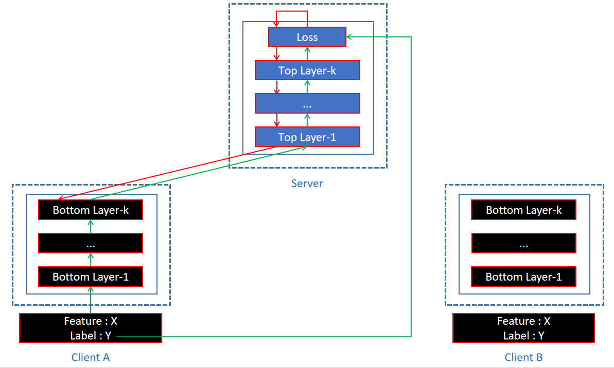
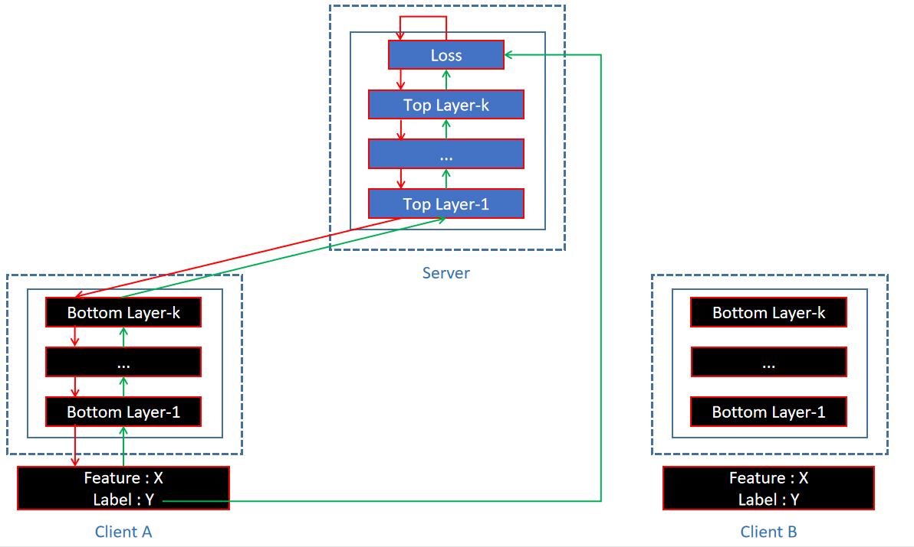

author: Yan Jinzhu
summary: Simple SplitLearning code to do homogeneous federated learning on MNIST.
id: homosplitlearning
tags: federatedlearning, splitlearning
categories: FederatedLearning
status: Published
feedback link: https://github.com/InspiringGroupCodelabs/InspiringGroupCodelabs.github.io/issues

# Homo - SplitLearning

## **Codelab Overview**

Duration: 0:01:00

接下来，本文档将以 MNIST 手写数字识别分类任务为例，通过 Pytorch 上的一些简单的代码为你讲解 SplitLearning 架构在横向联邦学习中的训练流程

Positive
: 如需完整的代码项目请访问 https://github.com/InspiringGroupCodelabs/SplitLearning

## **任务背景：横向联邦学习**

Duration: 0:10:00

首先，让我们先来回顾一下整个分类任务的背景 —— 横向联邦学习

如果我们拥有充足的训练数据，那么训练一个神经网络来对手写数字进行预测识别是一件再简单不过的事了，就像下面这张图片一样：



你只需要加载 MNIST 数据集，搭建一个简单的神经网络，按照 pipeline 对网络进行训练就可以完成整个训练流程，就像下面这一段简单的代码：

```python
import torch
from torchvision import datasets, transforms
from torch import nn, optim

# Define transformations
transform = transforms.Compose([transforms.ToTensor(),transforms.Normalize((0.5,), (0.5,))])

# Download dataset
train_set = datasets.MNIST('../datasets/MNIST/train', download=True, train=True, transform=transform)
val_set = datasets.MNIST('../datasets/MNIST/val', download=True, train=False, transform=transform)

train_loader = torch.utils.data.DataLoader(train_set, batch_size=64, shuffle=True)
val_loader = torch.utils.data.DataLoader(val_set, batch_size=64, shuffle=True)

# Define models
input_size = 784
hidden_sizes = [128, 64]
output_size = 10

# Build a feed-forward network
model = nn.Sequential(nn.Linear(input_size, hidden_sizes[0]),
                      nn.ReLU(),
                      nn.Linear(hidden_sizes[0], hidden_sizes[1]),
                      nn.ReLU(),
                      nn.Linear(hidden_sizes[1], output_size),
                      nn.LogSoftmax(dim=1))

criterion = nn.NLLLoss()
optimizer = optim.SGD(model.parameters(), lr=0.003, momentum=0.9)

epochs = 15
for e in range(epochs):
	for images, labels in train_loader:
		# Flatten MNIST images into a 784 long vector
		images = images.view(images.shape[0], -1)
		
		# Clean the gradients
		optimizer.zero_grad()

		# evaluate full model in one pass. 
		output = model(images)

		# calculate loss
		loss = criterion(output, labels)

		#backprop the second model
		loss.backward()
		
		#optimize the weights
		optimizer.step()
```

并最终在验证集上达到 0.97 左右的高准确率


但是，请你思考一个问题，如果我们的训练数据是被多个组织分散持有的，就像下面这张图片一样，那我们应该如何去训练呢？



如果每个组织分别使用自己持有的少量数据去训练，由于数据丰度的限制，最终模型的准确率会大打折扣

你这时可能会想：把各个组织的数据收集到一起，使用全部的数据一起训练不就可以了吗？

的确，如果各个组织都愿意共享自己持有的数据，那么这确实是最好的解决方案

可惜，在现实场景中，数据是具有巨大价值、并可能涉及隐私等敏感信息的，很难向其他组织索要数据，或是需要付出昂贵的代价


所以，我们应该如何在不泄露各组织所持有数据的情况下，联合使用这些数据来训练一个高性能的机器学习模型呢？—— 这，就是所谓的联邦学习

而横向则是对于特定数据分布场景的描述，就像上面的例子：各组织持有的数据分布在同一特征空间中，且重叠的数据样本较少




回顾完分类任务的背景，我们就将进入本文档的核心部分，也就是：SplitLearning 是如何实现横向联邦学习的


## **SplitLearning 的网络架构与训练流程**

Duration: 0:20:00

### **1 网络架构**

#### **将整个网络划分为 Top Model 和 Bottom Model 两部分**

首先，在 SplitLearning 架构中，将原本的整张神经网络拆分为了上下两个部分，我们暂且称他们为 Top Model 和 Bottom Model，并称 Bottom Model 的最后一个 Layer 为 Cut Layer

整张网络上的 dataflow 就像下面这张图片一样：



#### **Top Model 由 Server 管理，Bottom Model 由 Client 管理**

假设现在有若干个持有数据的组织想要通过联邦学习来共同训练一张神经网络，我们称每个组织为一个 Client，另外设置一个 Server 来帮助联合 Clients 进行训练

然后，我们把 Top Model 交给 Server 进行管理，把 Bottom Model 交给 Client 管理，每个 Client 都会在本地搭建一个 Bottom Model 用于计算和更新




### **2 训练流程**

Server 和 Client 配置好 Top Model 和 Bottom Model 之后，我们就可以开始训练了

以 Client A 为例，在一个训练轮次中，计算的流程可以分为以下几个步骤：


#### **Client 使用所持有数据在本地对 Bottom Model 进行前向传播**




#### **Client 将 Bottom Model 最后一个 Layer 的输出向量 以及 对应的 Lable 发送给 Server**



注意，此处将对应的 Lable 发送给 Server 是为了供 Server 后续计算 Loss 使用

Negative
: 如果不希望泄露 Lable，也可以只发送 Bottom Model 最后一个 Layer 的输出向量，待 Server 计算 Loss 时请求 Client 进行计算，再回传给 Server

Negative
: 该结构将于后续安全性分析的 codelab 中详细讨论，此处仅以上述简单结构对 SplitLearning 进行基本讲解


#### **Server 接收到 Bottom Model 输出向量 以及 对应的 Lable 后，对 Top Model 进行前向传播和反向传播**




#### **Server 将 Bottom Model 输出向量上的梯度回传给 Client**




#### **Client 接收到梯度后对 Bottom Model 进行反向传播**




#### **根据各个 Client 持有数据经反向传播后得到的梯度，对 Top Model 和 Bottom Model 进行聚合更新**

在一个训练轮次中，每个 Client 都像上面的 A 一样，同步进行着上述计算

计算完成后，每个 Client 的数据都会得到 Top Model 和 Bottom Model 上的一组梯度

此时需要对这些梯度进行聚合，并使用聚合后的结果更新 Top Model 和 Bottom Model

Negative
: Bottom Model 是否聚合 / 如何聚合可以基于性能和安全性考虑进一步分析，将于后续 codelab 中详细讨论


## SplitLearning 程序样例

Duration: 0:01:00

接下来我们将动手编写程序，在 Pytorch 上使用 SplitLearning 架构完成横向联邦学习场景下的 MNIST 手写数字识别分类任务

为简化程序逻辑以便于理解，并未模拟 Server 与 Clients 之间的同步通信环境，而是通过各个 Client 依次与 Server 交互完成计算的简单方式实现

Positive
: 后续将提供基于 socket 实现同步通信环境的版本


## **定义 Server 类、Client 类及其属性**

Duration: 0:03:00

首先，我们需要定义训练过程中的两个参与方 Server 和 Client，并明确其管理的数据与模型等属性


### **定义 Server 类及其属性**

```python
class Server:
    # Init Server with client_ids, top_model
    def __init__(self, client_ids, top_model):
        self.client_ids = client_ids
        self.top_model = top_model
        self.optimizer = optim.SGD(self.top_model.parameters(), lr=0.003, momentum=0.9)
        self.init_param = self.top_model.state_dict()
        self.update_cache = {}
```

其中：

| 属性         | 描述                                                         |
| ------------ | ------------------------------------------------------------ |
| client_ids   | 由各个 Client 的 id 构成的列表，用来标识参与任务的 Clients   |
| top_model    | 由 Server 负责 Top Model 的计算与更新                        |
| optimizer    | 更新 Top Model 使用的优化器                                  |
| init_param   | 记录每个训练轮次中，Top Model 的初始参数                     |
| update_cache | 记录每个训练轮次中，各个 Client 数据在 Top Model 上产生的更新，用以后续聚合 |


### **定义 Client 类及其属性**

```python
class Client:
    # Init Client with client_id, train_set, val_set, bottom_model
    def __init__(self, client_id, train_set, val_set, bottom_model):
        self.client_id = client_id
        self.train_set = train_set
        self.val_set = val_set
        self.bottom_model = bottom_model
        self.optimizer = optim.SGD(self.bottom_model.parameters(), lr=0.003, momentum=0.9)
```

其中：

| 属性         | 描述                                             |
| ------------ | ------------------------------------------------ |
| client_id    | Client 的 id，用以标识自身                       |
| train_set    | Client 所持有的数据，不离开本地                  |
| val_set      | 用于验证模型效果的验证集                         |
| bottom_model | 各个 Client 在本地进行 Bottom Model 的计算与更新 |
| optimizer    | 更新 Top Model 使用的优化器                      |


## **创建 Server 、Client 实例对象**

Duration: 0:06:00

接下来，我们将对训练所需的数据集进行划分，并定义具体的 top_model 和 bottom_model，从而创建参与训练的 Server 和 Client 的实例对象


### **所需导入的模块如下**

```python
from torchvision import datasets, transforms
from torch.utils.data import random_split
from torch import nn, optim
from split_no_socket.Client import Client, bottom_aggression
from split_no_socket.Server import Server
from copy import deepcopy
```


### **下载 MNIST 数据集，并对数据集进行划分** 

```python
# Define transformations
transform = transforms.Compose([transforms.ToTensor(), transforms.Normalize((0.5,), (0.5,))])

# Download dataset
train_set = datasets.MNIST('../datasets/MNIST/train', download=True, train=True, transform=transform)
val_set = datasets.MNIST('../datasets/MNIST/val', download=True, train=False, transform=transform)

# Split dataset
train_sets = random_split(train_set, [10000, 10000, 10000, 10000, 10000, 10000])
```

其中，transform 用于对 MNIST 数据集进行预处理

最终将 60000 个训练图像随机均匀拆分为 6 份，分别由 6 个 Client 所持有

Negative
: 注意，若使用 datasets.MNIST() 方法下载并读取 MNIST 数据集时报错，可能是因为依赖库的版本问题

Negative
: 作者所采用的 numpy 版本为 1.16.4，pytorch 版本为 1.7.1，torchvision 版本为 0.8.2，以供参考


### **定义 top_model 、bottom_model**

```python
# Define models
input_size = 784
hidden_sizes = [128, 64]
output_size = 10

bottom_model = nn.Sequential(nn.Linear(input_size, hidden_sizes[0]),
					nn.ReLU(),
					nn.Linear(hidden_sizes[0], hidden_sizes[1]))


top_model = nn.Sequential(nn.ReLU(),
					nn.Linear(hidden_sizes[1], output_size),
					nn.LogSoftmax(dim=1))
```

将前文中的完整 model 拆分为了 top_model 和 bottom_model 上下两部分


### **创建 Server 、Client 实例对象**

```python
# Define Clients and Server
A = Client('A', train_sets[0], val_set, deepcopy(bottom_model))
B = Client('B', train_sets[1], val_set, deepcopy(bottom_model))
C = Client('C', train_sets[2], val_set, deepcopy(bottom_model))
D = Client('D', train_sets[3], val_set, deepcopy(bottom_model))
E = Client('E', train_sets[4], val_set, deepcopy(bottom_model))
F = Client('F', train_sets[5], val_set, deepcopy(bottom_model))
server = Server(['A', 'B', 'C', 'D', 'E', 'F'], top_model)
```

按照划分后的数据集和模型，创建 6 个 Client 实例对象 和 1 个 Server 实例对象


## **编写 SplitLearning 的训练流程**

Duration: 0:25:00

创建完 Server 、Client 实例对象后，我们将开始编写具体的训练程序

为简化程序逻辑以便于理解，并未模拟 Server 与 Clients 之间的同步通信环境，而是通过各个 Client 依次与 Server 交互完成计算的简单方式实现训练


### **整体训练流程**

```python
# Train the whole model
iterations = 15
for i in range(iterations):
	# Init setting before an iteration
	server.init_setting()
	print("\nIteration {} start".format(i))

	# ForwardProp and BackProp by different Clients and Server
	A.train(server, epochs=1)
	B.train(server, epochs=1)
	C.train(server, epochs=1)
	D.train(server, epochs=1)
	E.train(server, epochs=1)
	F.train(server, epochs=1)

	# Aggression for top_model and bottom_model
	server.top_aggression()
	bottom_aggression([A, B, C, D, E, F])
```


接下来，让我们逐步解读每个训练轮次中调用的函数：


* Server 的 `init_setting` 方法

```python
class Server:
    # skip other functions

    # Init setting before an iteration
    def init_setting(self):
        self.init_param = self.top_model.state_dict()
        self.update_cache = {}
```

每个训练轮次中，Server 首先要记录该轮次开始时 top_model 的参数

对于每个 Client，Server 均以上述参数作为 top_model 的初始参数，并缓存每个 Client 对 top_model 参数的更新，最终对所有 Client 所得的更新进行聚合，使用聚合的结果作为本训练轮次对 top_model 参数的更新


- Client 的 `train` 方法

在一个训练轮次中，每个 Client 的计算流程如下：

将本地训练数据代入 bottom_model 进行前向传播得到中间输出向量 output

```python
class Client:
    # skip other functions
    
    # Use this Client's data to train the whole model in a iteration
    def train(self, Server, epochs):
        # Load this Client's data for train
        train_loader = torch.utils.data.DataLoader(self.train_set, batch_size=64, shuffle=True)

        for epoch in range(epochs):
            for images, labels in train_loader:
                # Flatten MNIST images into a 784 long vector
                images = images.view(images.shape[0], -1)

                # Cleaning gradients
                self.optimizer.zero_grad()

                # ForwardProp of bottom_model
                output = self.bottom_model(images)
```

Client 把中间输出向量和对应的 Label 发送给 Server 进行 top_model 的前向传播与反向传播，并等待 Server 回传 bottom_model 反向传播所需的梯度

```python
				# Prepare vector for Server
                vector2Server = Variable(output.data, requires_grad=True)

                # Get gradient from Server
                gradient2Client, loss = Server.top_calculation(vector2Server, labels)		
```

Client 得到 bottom_model 反向传播所需的梯度后，对 bottom_model 进行反向传播

```python
				# BackProp of bottom_model
                output.backward(gradient2Client)

                # Optimize the weights
                self.optimizer.step()
```

该 Client 在本训练轮次中的计算完成后，Server 将其对 top_model 的更新缓存起来，并将 top_model 参数 reset 为本轮次的初始参数

```python
			# Call the Server to record the updated parameters of top_model by this Client's data
            Server.record_update(self.client_id)
```


*   Server 的 `top_calculation` 方法

```python
class Server:
    # skip other functions
    
    # Receive vector2Server, labels from Client
    # Do ForwardProp, BackProp for top_model
    # Return gradient to Client
    def top_calculation(self, vector2Server, labels):
        # Cleaning gradients
        self.optimizer.zero_grad()

        # ForwardProp of top_model
        output = self.top_model(vector2Server)

        # Calculate losses
        criterion = nn.NLLLoss()
        loss = criterion(output, labels)

        # BackProp of top_model
        loss.backward()

        # Optimize weights
        self.optimizer.step()

        # Return gradient to Client
        return vector2Server.grad, loss.item()
```

Server 得到中间输出向量和对应的 Label 后，进行 top_model 的前向传播与反向传播，并回传 bottom_model 反向传播所需的梯度给 Client


*   Server 的 `record_update` 方法

```python
class Server:
    # skip other functions
    
    # Record the updated parameters of top_model by this Client's data
    # Reset top_model to the init parameter of this iteration(for next Client to train)
    def record_update(self, client_id):
        # Record the updated parameter of top_model by this Client's data
        updated_param = self.top_model.state_dict()
        if client_id in self.update_cache.keys():
            print('Duplicate training on a Client in this iteration!')
            exit(-1)
        else:
            self.update_cache[client_id] = updated_param

        # Reset top_model to the init parameter of this iteration(for next Client to train)
        self.top_model.load_state_dict(self.init_param)
```

Server 将 Client 对 top_model 的更新缓存起来，用于后续 top_model 的聚合更新

并将 top_model 参数 reset 为本轮次的初始参数，保证其他 Client 计算时 top_model 为初始参数


* Server 的 `top_aggression` 方法

```python
class Server:
    # skip other functions
    
    # Aggression for top_model
    def top_aggression(self):
        num = len(self.client_ids)
        if num == 0:
            return

        # Calculate the mean of Clients's updated parameters for top_model
        model_dict = self.update_cache[self.client_ids[0]]

        for i in range(1, num):
            client_id = self.client_ids[i]
            client_dict = self.update_cache[client_id]
            for weights in model_dict.keys():
                model_dict[weights] = model_dict[weights] + client_dict[weights]
        for weights in model_dict.keys():
            model_dict[weights] = model_dict[weights] / num

        # Use load_state_dict() to update the parameter of top_model
        self.top_model.load_state_dict(model_dict)
```

Server 将各个 Client 对 top_model 的更新求平均

将 top_model 的参数更新为平均结果

Negative
: 此处使用最简单的聚合方法，没有进一步考虑聚合的性能，以便于理解学习

Negative
: 后续 codelab 中会进一步讨论聚合的相关方法


* `bottom_aggression` 方法

```python
# Aggression for Clients's bottom_model(Not Secure)
def bottom_aggression(clients):
    num = len(clients)
    if num == 0:
        return

    # Use state_dict() to get the parameter of Clients's bottom_model
    # Calculate the mean of these parameters
    model_dict = clients[0].bottom_model.state_dict()
    for i in range(1, num):
        client = clients[i]
        client_dict = client.bottom_model.state_dict()
        for weights in model_dict.keys():
            model_dict[weights] = model_dict[weights] + client_dict[weights]
    for weights in model_dict.keys():
        model_dict[weights] = model_dict[weights] / num

    # Use load_state_dict() to update the parameter of Clients's bottom_model
    for client in clients:
        client.bottom_model.load_state_dict(model_dict)
```

对各个 Client 的 bottom_model 参数求平均

并将各个 Client 的 bottom_model 参数更新为平均结果

Negative
: 此处使用最简单的聚合方法，没有进一步考虑聚合的性能和安全性，以便于理解学习

Negative
: 后续 codelab 中会进一步讨论聚合的相关方法


## **SplitLearning 的性能评估**

Duration: 0:05:00

使用 Client 的 `val` 方法将 bottom_model 和 top_model 拼接起来，并在验证机上测试整个模型的分类性能：

```python
# Validate the accuracy
A.val(server.top_model)
```

* Client 的 `val` 方法

```python
class Client:
    # skip other functions
     
    def val(self, top_model):
        # Load the data for val
        val_loader = torch.utils.data.DataLoader(self.val_set, batch_size=64, shuffle=True)

        correct_count, all_count = 0, 0
        for images, labels in val_loader:
            for i in range(len(labels)):
                # Flatten MNIST images into a 784 long vector
                img = images[i].view(1, 784)

                with torch.no_grad():
                    # ForwardProp of bottom_model
                    output1 = self.bottom_model(img)
                    y2 = Variable(output1.data, requires_grad=False)
                    # ForwardProp of top_model
                    logps = top_model(y2)

                ps = torch.exp(logps)
                probab = list(ps.numpy()[0])
                pred_label = probab.index(max(probab))
                true_label = labels.numpy()[i]
                if (true_label == pred_label):
                    correct_count += 1
                all_count += 1

        print("\nNumber Of Images Tested =", all_count)
        print("Client {} Model Accuracy =".format(self.client_id), (correct_count / all_count), "\n")
```


### **最终分类性能**

| 训练方法                                    | 分类性能 |
| ------------------------------------------- | -------- |
| 将训练集全部集中到一起直接训练整个网络      | 0.97     |
| 将训练集均分至 6 个 Client 的 SplitLearning | 0.96     |
| 使用训练集的 1 / 6 训练整个网络             | 0.93     |

可见 SplitLearning 能够在保护各个 Client 数据不出本地的前提下，联合训练出性能更好的模型 

