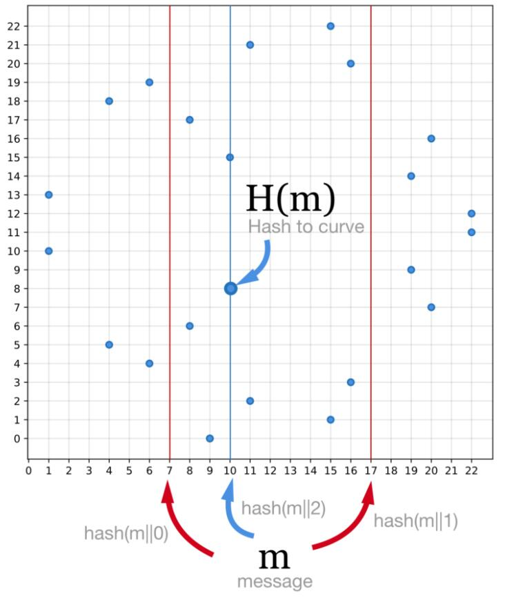
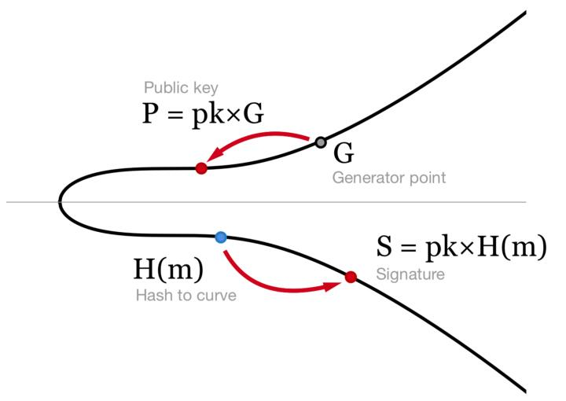
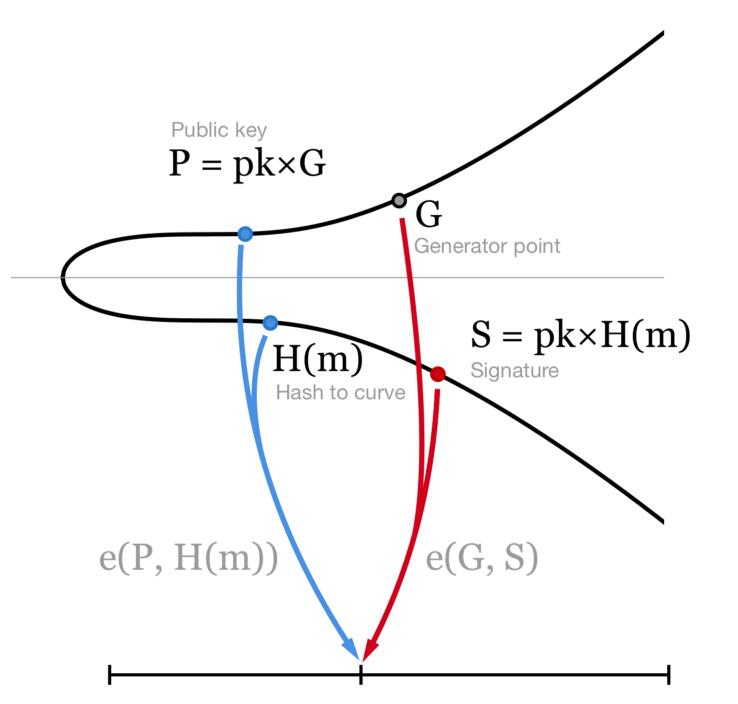

author: Yan Jinzhu
summary: Theoretical principle and simple implementation of BLS signature.
id: bls
tags: appliedcryptography
categories: appliedcryptography
status: Published
feedback link: https://github.com/InspiringGroupCodelabs/InspiringGroupCodelabs.github.io/issues

# BLS signature

## **Codelab Overview**

Duration: 0:01:00

本 Codelab 将讲解 BLS 签名的理论原理，并基于 PBC 库对 BLS 签名流程进行简单实现，以下为 BLS 的简单介绍：

BLS 是一种具有以下特点的签名算法：

* 可以实现签名聚合和密钥聚合，容易实现 m - n 阈值签名

  * 签名聚合：在知道 m 个签名的条件下，可以合成唯一一个合法的签名。任意 m 个签名片段的组合都是同一个可验证的签名。

  * 密钥聚合：每个人只有一个私钥片段，需要 m 个私钥片段组合在一起才能形成一个合法的完整的私钥。如果少于 m 个私钥片段在网络中共享的话，就不会有任何一个个人知道这个完整的私钥。

* 聚合签名算法无需依赖随机数生成器，且可以避免签名者之间的多余通信

* 签名的长度为 ECDSA 和 Schnorr 签名算法的二分之一

对于有非常多的验证者都要对消息做签名的阈值签名场景，要保证系统的安全性，同时节约存储空间，避免对每个签名做单独验证的低效行为，就需要用到 BLS 这类签名聚合的算法。

## 辅助知识

Duration: 0:05:00

在正式进入 BLS 签名过程之前，我们需要先理解两个基础概念：曲线哈希（hashing to the curve） 和 曲线配对（curves pairing）

### **曲线哈希（hashing to the curve）**

一般的 hash 函数会根据消息计算出一个数字结果，而曲线哈希（hashing to the curve） 则希望将 hash 函数对消息的计算结果直接映射到椭圆曲线上的一个点。

最简单的对应思路为：将一般 hash 函数对消息计算出的数字结果作为 x 值，在椭圆曲线上寻找相应的点。

下面以常用的椭圆曲线 secp256k1（比特币使用的椭圆曲线） 和 hash 函数 SHA-256 为例来说明该对应思路存在的问题与解决的方法：

首先，椭圆曲线 secp256k1 有 2<sup>256</sup> 个点，而 hash 函数 SHA-256 的计算结果也是 256 位。

如果直接以 hash 函数 SHA-256 的计算结果作为 x 值在椭圆曲线 secp256k1 上映射点，由于对于椭圆曲线范围内每个 x 值，可以对应两个点 (x, y) 和 (x, -y)，所以我们最多将 50% 的计算结果映射到不同的点对上，而剩余 50% 的结果则没有映射目标

为了让每个 SHA-256 的结果，都能映射到椭圆曲线上的一个点，采用如下的方法： 

在每个消息 m 后附加一个数字序号 i，从 i 为 0 开始，将 m || i 代入 hash 函数计算

* 如果计算结果在椭圆曲线的 x 值范围内，则停止计算，并将消息映射到点 (x, -y)，y>0
* 如果计算结果在椭圆曲线的 x 值范围之外，则将 i 增加 1，再次代入 hash 函数计算



按照该方法，我们就可以将每个消息 m 对应到椭圆曲线的一个点上。

### **曲线配对（curves pairing）**

为了实现曲线配对（curves pairing），我们需要一个特殊的函数 e，对于椭圆曲线上任意的两个点 P 和 Q，e 函数能将它们映射到一个数值上，即：

* e(P, Q) —> n

除此之外，这个特殊的函数 e 还需要具有一个性质：给定一个 secret number **x**，不论 **x** 和 P 或者 Q 哪个点相乘，e 函数的结果相同，即：

* e(**x** * P, Q) = e(P, **x** * Q)

基于这个性质，我们可以进行如下推导：

* e(a * P, b * Q) = e(P, ab * Q) = e(ab * P, Q) = e(P, Q) ^ (ab)


我们称这样的特殊函数 e 为双线性映射函数，对于双线性椭圆曲线，一定可以找到具有上述性质的双线性映射函数 e。

Positive
: 双线性映射函数的存在证明与确定方法此处不再赘述，感兴趣的同学可以自行研究（[https://medium.com/@VitalikButerin/exploring-elliptic-curve-pairings-c73c1864e627](https://medium.com/@VitalikButerin/exploring-elliptic-curve-pairings-c73c1864e627)，[https://crypto.stanford.edu/pbc/thesis.pdf](https://crypto.stanford.edu/pbc/thesis.pdf)）

## BLS 签名及验证过程

Duration: 0:05:00

对于易于配对的椭圆曲线簇中的某个椭圆曲线，给定私钥 **pk**，公钥 **P = pk×G**，以及待签名的消息为**m**

BLS 签名的计算公式为：**S = pk×H(m)**

其中 H(m) 是之前讲述的曲线哈希（hashing to curve）函数，过程如下图所示：



验证签名的过程设计之前讲述的双线性映射函数 e，计算如下的等式是否成立即可：

​	**e(P, H(m)) = e(G, S)**

对于合法签名，该等式一定成立的证明过程如下：

​	**e(P, H(m)) = e(pk×G, H(m)) = e(G, pk×H(m)) = e(G, S)**

也就是在双线性映射函数 e 的特殊性质之下，两个点对 (P, H(m)) 和 (G, S) 会被映射到相同的数值上，示意图如下：



## BLS 对签名的聚合验证

Duration: 0:05:00

下面用一个小例子说明如何基于 BLS 实现签名的聚合验证：

假设一个区块中有1000个交易，每个交易都有独立的公钥Pi，签名Si，以及交易内容mi。

如果需要知道区块中的交易的签名是否都正确，传统的方式，区块中的交易需要一个个的验证签名。并且，区块中需要存储所有交易的签名。

用BLS算法进行签名的合并只需要存储一个33个字节的BLS签名。合并签名的结果是：

​	**S = S1+S2+…+S1000**

验证过程是：

​	**e(G, S) = e(P1, H(m1))⋅e(P2, H(m2))⋅…⋅e(P1000, H(m1000))**

证明过程如下：

**e(G, S) = e(G, S1+S2+…+S1000) = e(G, S1)⋅e(G, S2)⋅…⋅e(G, S1000) = e(G, pk1×H(m1))⋅…⋅e(G, pk1000×H(m1000)) = e(pk1×G, H(m1))⋅…⋅e(pk1000×G, H(m1000)) = e(P1, H(m1))⋅e(P2, H(m2))⋅…⋅e(P1000, H(m1000))**

从证明过程可见，主要是用了e函数的交换规则

## 基于 PBC 库对 BLS 签名流程进行简单实现

Duration: 0:10:00

### **PBC库简介**

[Pairing-based cryptography library](https://crypto.stanford.edu/pbc/) 是在 [gmp](https://gmplib.org/) 库基础上开发的 C 函数库，提供了对椭圆曲线群上的配对运算支持

### **基础说明**

* 公开系统参数
* 定义阶为质数 r 的三个群G1，G2，GT（定理：阶为质数的群都是循环群）
  * 定义双线性映射 e: G1*G2–>GT
* 定义 G2 的一个随机生成元 g


* Alice 想要对一个消息 m 签名。她通过如下方法生成公钥和私钥并完成签名过程：

  * 私钥：Zr 的一个随机元素 x
  * 公钥：g^x

  * Alice 将消息 m 作为输入，通过哈希算法得到 hash 值 hash(m)，再映射到 G1 的一个元素 h 上
* 使用私钥 x 对 h 进行签名得到 sig=h^x，将 sig 发给Bob


* Bob 验证签名sig，即 check 双线性映射等式 e(sig, g) = e(h, g^x) 是否成立

  * 原理：双线性映射 e 具有以下性质
  * e(sig, g) = e(h^x, g) = e(h, g)^x =e(h, g^x)

### **基于 PBC 库的 BLS 实现代码（example/bls.c）**

* include PBC 库

  ```c++
  #include <pbc.h>
  ```

* 初始化一个双线性配对

  ```c++
  // 定义一个双线性对
  pairing_t pairing;
  // 实例化双线性对
  pbc_demo_pairing_init(pairing, argc, argv);
  ```

* 定义系统参数并初始化

  ```c++
  element_t g, h;
  element_t public_key, secret_key;
  element_t sig;
  element_t temp1, temp2;  // 用于放置验证等式中两侧的临时计算结果
  
  // 实例化属于 G2 的参数
  element_init_G2(g, pairing);
  element_init_G2(public_key, pairing);
  
  // 实例化属于 G1 的参数
  element_init_G1(h, pairing);
  element_init_G1(sig, pairing);
  
  // 实例化属于 GT 的参数
  element_init_GT(temp1, pairing);
  element_init_GT(temp2, pairing);
  
  // 实例化属于 Zr 的参数
  element_init_Zr(secret_key, pairing);
  
  //随机生成一个元素值 g（因为 g 定义在 G2，所以是 G2 中的任意值）
  element_random(g);
  element_printf("system parameter g = %B\n", g);
  
  //随机生成 Alice 的私钥
  element_random(secret_key);
  element_printf("private key = %B\n", secret_key);
  
  //根据私钥计算出 Alice 的公钥
  element_pow_zn(public_key, g, secret_key);
  element_printf("public key = %B\n", public_key);
  ```

* Alice 对消息 m 进行签名

  首先我们使用一些标准的hash算法去计算它的hash值。

  许多的库可以这样做，而且这个操作不涉及双线性配对，因此PBC不提供这一步的函数。

  假设我们已经得到这个消息的hash值是 “hashofmessage”，我们将这些比特映射到 G1 的一个元素 h 上

  ```c++
  //根据存储在缓冲区数据中的len（13）个字节--hashofmessage，确定地生成一个元素h。
  //for toy pairings, 生成的 h 要满足 pairing(g, h) != 1
  element_from_hash(h, "hashofmessage", 13);
  element_printf("message hash = %B\n", h);
  ```

  然后使用私钥对 h 进行签名得到 sig

  ```c
  //sig = h^secret_key， is the signature
  //在现实情景中：只输出第一个坐标
  element_pow_zn(sig, h, secret_key);
  element_printf("signature = %B\n", sig);
  ```

* 实际应用中，在某些阶段必须将签名压缩为字节才能存储或传输

  ```c++
  {
    //返回表示G1元素的压缩形式所需的长度（以字节为单位）,解压缩会有一些开销。
    int n = pairing_length_in_bytes_compressed_G1(pairing);
    //int n = element_length_in_bytes_compressed(sig); n 的另一种计算方式，返回以压缩形式保存sig所需的字节数.
  
  	//分配一块内存，用于暂存压缩结果
      unsigned char *data = pbc_malloc(n);
  	//将元素sig的压缩形式输出到字节数据缓冲区。
      element_to_bytes_compressed(data, sig);
      //print 压缩之后的结果
      printf("compressed = ");
      for (int i = 0; i < n; i++) {
  	// 输出 不足两位前面补0，足，原样输出
        printf("%02X", data[i]);
      }
      printf("\n");
      
  	//在字节数据缓冲区中将元素sig设置为压缩形式的元素。
      element_from_bytes_compressed(sig, data);
      element_printf("decompressed = %B\n", sig);
  
      pbc_free(data);
  }
  ```

* Bob 对签名 sig 的验证

  将 `签名 sig、系统参数g 和 双线性配对 生成的值` 与 `h、公钥 和 双线性配对 生成的值` 进行比较。

  如果这两个输出匹配，说明这个签名是有效的

  ```c++
  //verification part 1: e(sig, g)  
  element_pairing(temp1, sig, g);
  element_printf("f(sig, g) = %B\n", temp1);
  
  //verification part 2: e(h, g^x)
  //should match above
  element_pairing(temp2, h, public_key);
  element_printf("f(message hash, public_key) = %B\n", temp2);
  
  // e(sig, g) = e(h, g^x) ?
  if (!element_cmp(temp1, temp2)) {
    printf("signature verifies\n");
  } else {
    printf("*BUG* signature does not verify *BUG*\n");
  }
  ```

  可以随机生成一个无效的签名，将无法通过验证

  ```c++
  //a random signature shouldn't verify
  element_random(sig);
  element_pairing(temp1, sig, g);
  
  if (element_cmp(temp1, temp2)) {
      printf("random signature doesn't verify\n");
  } else {
      printf("*BUG* random signature verifies *BUG*\n");
  }
  ```

* 实际应用中，在某些阶段必须将签名转化为字节才能存储或传输

  ```c++
  // 返回表示G1元素的压缩形式所需的长度（以字节为单位）
  int n = pairing_length_in_bytes_compressed_G1(pairing);
  // Alternatively:
  // int n = element_length_in_bytes_compressed(sig);
  unsigned char *data = malloc(n);
  element_to_bytes_compressed(data, sig);
  ```

  在另一方面，这个签名必须能够解压

  ```c++
  element_from_bytes_compressed(sig, data);
  // 省略 _compressed 在上面的代码中同样也能工作，但是缓冲区的大小大概会变为两倍
  ```

  通过使用仅仅适用于签名的*x*-coordinate，我们能够节省更多的空间

  ```c++
  int n = pairing_length_in_bytes_x_only_G1(pairing);
  // Alternative:
  // int n = element_length_in_bytes_x_only(sig);
  unsigned char *data = malloc(n);
  element_to_bytes_compressed(data, sig);
  ```

  但是由于有两个不同的点有相同的x坐标，在验证的时候会比较复杂。一种解决办法是选取一个点并试图去验证，如果失败了，我们在去尝试另外一个。可以看出这两个点互为逆元，避免了第二次计算双线性映射（实际上这是一个更好的处理问题的办法）

  ```c++
  // 返回表示G1元素的x坐标所需的长度（以字节为单位）
  int n = pairing_length_in_bytes_x_only_G1(pairing);
  // Alternative:
  // int n = element_length_in_bytes_x_only(sig);
  unsigned char *data = malloc(n);
  
  element_to_bytes_x_only(data, sig);
  
  element_from_bytes_x_only(sig, data)
  
  pairing_apply(temp1, sig, g, pairing);
  pairing_apply(temp2, h, public_key, pairing);
  
  if (!element_cmp(temp1, temp2)) {
    printf("signature verifies on first guess\n");
  } else {
    element_invert(temp1, temp1);
    if (!element_cmp(temp1, temp2)) {
        printf("signature verifies on second guess\n");
    } else {
        printf("signature does not verify\n");
    }
  }
  ```

* 最后释放元素空间

  ```c++
  element_clear(sig);
  element_clear(public_key);
  element_clear(secret_key);
  element_clear(g);
  element_clear(h);
  element_clear(temp1);
  element_clear(temp2);
  pairing_clear(pairing);
  return 0;
  ```

  